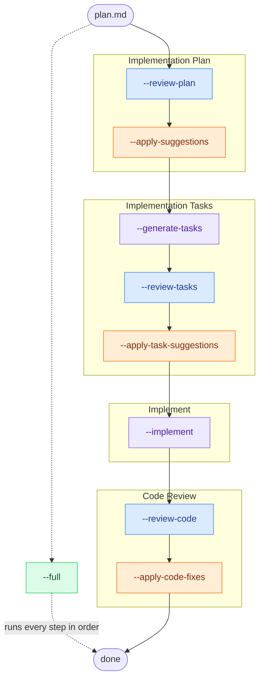

# multi-llm - Harness the harnesses


**Wisdom of crowds for your codebase.** Use this plugin to improve planning, implementation, and code review by running the same work through multiple AI coding tools and LLMs in parallel - then consolidating their feedback so you catch bugs, blind spots, and improvements a single model might miss.

The diversity works on two axes: not only do you get different **LLM models** (Opus, GPT, Gemini, Grok, Composer, ...), you also get different **code harnesses** (Codex, OpenCode, Cursor Agent, Gemini CLI, Grok Build, Cline, goose, Aider, Antigravity CLI, ...) - each with its own prompting, tooling, and context-gathering behavior. Two harnesses running the *same* model can still surface different findings, so combining both axes widens the crowd further.

📺 **[Watch the video tutorial](https://www.youtube.com/watch?v=_ySRt7rr0r8)** for a walkthrough of the plugin in action.

Orchestrate **plan reviews, task generation, implementation, and code reviews across multiple LLM providers in parallel** - or ask every model the same free-text question about a plan and get one consolidated answer.

`multi-llm` fans a single workflow out to several CLI-based LLMs ([Cursor Agent](https://cursor.com/docs/cli/overview), [Gemini CLI](https://geminicli.com/docs/get-started/), [Grok Build](https://docs.x.ai/build), [Codex](https://developers.openai.com/codex/cli), [OpenCode](https://opencode.ai/docs/cli/), [Kilocode](https://kilo.ai/docs/cli), [Cline](https://docs.cline.bot/), [goose](https://block.github.io/goose/), [Aider](https://aider.chat/), [Antigravity CLI](https://antigravity.google/docs/cli/using), and [Claude Code](https://code.claude.com/docs/en/) itself), validates and consolidates their suggestions, and hands Claude Code structured instructions to apply the results. The orchestrators never modify your code directly - they produce JSON that Claude Code executes through its own tools, so every change stays reviewable.

---

## Installation

In Claude Code:

```text
/plugin marketplace add beastlabai/multi-llm-plugin
/plugin install multi-llm@beastlabai
/reload-plugins
/reload-skills
/multi-llm:multi-llm --init
```

> **Already added the marketplace before (e.g. in another project)?** `/plugin marketplace add` does **not** refetch an existing marketplace - it silently reuses the locally cached copy, so `/plugin install` will give you a stale version. Follow [Updating](#updating) instead.

Then invoke the skill (plugin skills are namespaced `plugin:skill`):

```text
/multi-llm:multi-llm plans/my-feature.md
```

> Claude can also load the skill automatically when you ask it to "review my plan with multiple models", "run a multi-LLM code review", etc.

### Updating

The marketplace cache only refreshes when you explicitly ask it to - `/plugin marketplace update` is the step that actually pulls the latest commits from GitHub. Then update (or install) the plugin and reload:

```text
/plugin marketplace update beastlabai
/plugin update multi-llm@beastlabai
/reload-plugins
/reload-skills
/multi-llm:multi-llm --init --force
```


### Configure providers (required before first use)

Edit [`skills/multi-llm/providers.yaml`](skills/multi-llm/providers.yaml) manually to match the code harnesses and models you want to use. The shipped file is a starting point only - keep the providers whose CLIs you have installed, remove the rest, and set `defaults.models` (and optionally `quick_models`) to the `provider:model` pairs you actually run. Without this step, default invocations will call harnesses or models you may not have configured. See [Providers](#providers) for the format and available keys.

> **Where is the file after installing via `/plugin`?** If you installed the plugin (rather than cloning this repo), `providers.yaml` lives inside the installed plugin, under your Claude Code plugins directory - typically `~/.claude/plugins/<marketplace>/multi-llm/skills/multi-llm/providers.yaml`. The quickest way to open it is to ask Claude Code to "open the multi-llm `providers.yaml`": the skill resolves its own install location (via `${CLAUDE_SKILL_DIR}`), so Claude can read and edit the file in place.

### Prerequisites

| Requirement | Why |
| --- | --- |
| [`uv`](https://docs.astral.sh/uv/) on your `PATH` | The orchestrators run as `uv run` Python scripts. uv installs their dependencies (just `pyyaml`) on first use. |
| One or more provider CLIs | You only need the CLIs for the models you actually run. See [Providers](#providers). |

The plugin ships its own `pyproject.toml`/`uv.lock`, so no manual Python setup is required - `uv` resolves the environment the first time a mode runs.

---

## Plans and outputs

A **plan** is just a markdown file describing the change you want to make - a feature spec, refactor outline, or design doc. You write it (or have Claude draft it), then point multi-llm at it. There's no required template; the more concrete the plan, the more useful the reviews. Most workflows start from a plan, with one exception: `--ask` only needs a plan to give the models context for your question.

The path you pass (e.g. `plans/my-feature.md`) is always a **file**. From it, multi-llm derives a sibling **output directory** in the same folder, named after the plan file without its extension - so `plans/my-feature.md` produces `plans/my-feature/`. All workflow state and generated artifacts live there:

| Path | Written by |
| --- | --- |
| `plans/my-feature/state.json` | every mode (tracks workflow progress) |
| `plans/my-feature/review-plan/` | `--review-plan`, `--apply-suggestions` |
| `plans/my-feature/tasks/` | `--generate-tasks`, `--review-tasks` |
| `plans/my-feature/implement/summary.md` | `--implement` |
| `plans/my-feature/code-review/report.md` | `--review-code`, `--apply-code-fixes` |
| `plans/my-feature/ask/<question-slug>/answers.md` | `--ask` |

Throughout this README and the skill docs, `{plan}/...` refers to that derived directory. Because everything is stored next to the plan, a workflow is fully portable - move or commit the plan folder and its state travels with it.

---

## Modes

Invoke with `/multi-llm:multi-llm [mode-flag] <plan_path> [options]`. With no mode flag, `--review-plan` is the default.

| Flag | What it does |
| --- | --- |
| `--review-plan` | Review an implementation plan with multiple LLMs (default) |
| `--apply-suggestions` | Apply validated review suggestions back into the plan |
| `--generate-tasks` | Generate detailed implementation tasks from a high-level plan |
| `--review-tasks` | Review generated tasks with multiple LLMs |
| `--apply-task-suggestions` | Apply validated task-review suggestions to `tasks.md` |
| `--implement` | Execute implementation tasks via subagent delegation |
| `--review-code` | Review code changes against the plan |
| `--apply-code-fixes` | Apply validated fixes from a code review |
| `--full` | Run the whole pipeline in sequence |
| `--status` | Show workflow state and the suggested next action |
| `--ask` | Ask each model a free-text question about a plan; aggregate the answers |

Two notes on the table above:

- **`--full`** chains the phases end to end: review-plan -> apply-suggestions -> generate-tasks -> review-tasks -> apply-task-suggestions -> implement -> review-code -> apply-code-fixes. It pauses at each apply step to let you approve `needs-human-decision` findings; pass `--yes` (alias `--non-interactive`) to run the whole pipeline fully unattended — zero prompts: non-interactive model selection, Claude decides every `needs-human-decision` item, and review-tasks runs automatically. For finer control, add just `--no-confirm` and/or `--claude-decide` (see [below](#letting-claude-decide-ambiguous-findings)) instead.
- **Applying code fixes** can happen two ways. Run `--apply-code-fixes` as a standalone pass to apply a previous review's fixes - this is the phase that handles `needs-human-decision` items (prompts, salvage, HTML badges). Or, to apply only the clearly-valid fixes inline during the review itself, add `--apply-fixes` to a `--review-code` run.

### Pipeline flow

The mode flags are designed to run as an ordered pipeline (exactly what `--full` chains for you). Each **review** step fans the work out to multiple LLMs in parallel; each **apply** step is where Claude Code writes the changes back and pauses for any `needs-human-decision` findings.



🔵 **Review** steps query multiple models in parallel · 
🟠 **Apply** steps let Claude Code write changes and pause for `needs-human-decision` items ·
🟣 **Generate & implement** steps produce tasks and write code · 
🟢 **`--full`** runs the entire flow with one command.


You don't have to run the whole chain: **every step is also a standalone entry point** that reads/writes the shared `{plan}/state.json`, so you can start, stop, and resume at any phase. A few modes sit outside the pipeline - **`--ask`** (read-only Q&A about a plan), **`--status`** (show progress and the suggested next step), and **`--init`** (write a per-project config) - while **`--full`** simply runs the entire flow above end to end.

### Examples

```text
# Review a plan using the configured default LLMs
/multi-llm:multi-llm plans/my-feature.md

# Pick models explicitly, from several providers
/multi-llm:multi-llm --review-plan plans/my-feature.md --models codex:gpt-5.5-extra-high cursor-agent:composer-2.5

# Quick review (fewer, preselected subset of models)
/multi-llm:multi-llm --review-plan plans/my-feature.md --quick

# Review code changes against the plan
/multi-llm:multi-llm --review-code plans/my-feature.md

# Review/implement/code-review a plan using the configured default LLMs completely hands-off
/multi-llm:multi-llm --full plans/my-feature.md --claude-decide --non-interactive

# Ask every model the same question (read-only Q&A)
/multi-llm:multi-llm --ask plans/my-feature.md "Is the rollback strategy sufficient?"
```

### Options

These flags combine with any mode and are **position-independent** - they may appear before or after the plan path (and, for `--ask`, around the question). Not every flag applies to every mode.

| Flag | Effect |
| --- | --- |
| `--models <provider:model> ...` | Use exactly these models (variadic), overriding YAML defaults. Each must exist in `providers.yaml`. |
| `--quick` | Use the smaller `quick_models` subset for a faster  run. |
| `--interactive` | Force two-step model selection (provider, then models), ignoring YAML defaults. |
| `--no-confirm` | Skip confirmation prompts - for unattended/silent runs. |
| `--dry-run` | Show what would happen (tasks/batches) without making changes. Applies to `--implement` and the apply modes. |
| `--claude-decide` / `--let-claude-decide` | In the apply modes, let a Claude subagent judge every `needs-human-decision` finding instead of prompting you (see [below](#letting-claude-decide-ambiguous-findings)). |
| `--force` | **Meaning depends on mode.** In the fan-out review/ask modes (`--review-plan`, `--review-tasks`, `--review-code`, `--ask`), resume an interrupted run: keep already-completed per-model results, run only the missing models, and bypass the completed-phase / partial-completion guards. In the apply modes, it's an alias for `--yes` (confirm bulk approval). |
| `--rerun-all` | In the fan-out review/ask modes, re-run every model from scratch, discarding any existing per-model results. Combine with `--force` (`--force --rerun-all`) for a fresh full re-run of an already-completed phase. |

The apply and implement modes accept additional approval flags (`--yes`, `--approve-all`, `--resume`, `--task`, and more); see [`SKILL.md`](skills/multi-llm/SKILL.md) and the per-mode files in `skills/multi-llm/instructions/`.

### Letting Claude decide ambiguous findings

When the models disagree or a suggestion is borderline, validation marks it `needs-human-decision`. In the apply modes (`--apply-suggestions`, `--apply-code-fixes`, `--apply-task-suggestions`) you're normally prompted via `AskUserQuestion` to approve or skip each one - and every prompt also offers a **Let Claude decide** option, per item or for a whole batch, that hands just that judgment to a Claude subagent instead of you.

To skip the prompts entirely and have Claude judge **every** `needs-human-decision` finding up front, pass `--claude-decide` (alias `--let-claude-decide`):

```text
/multi-llm:multi-llm --apply-code-fixes plans/my-feature.md --claude-decide --no-confirm
```

Unlike the blanket approve/skip flags, "Let Claude decide" is a **per-item** judgment that **salvages** partially-valid findings - it trims each to its worthwhile core and applies that, skipping only findings with nothing worth keeping. The generated HTML report badges every finding **Approved / Salvaged / Skipped**. Add `--no-confirm` (as above) for a fully unattended run.

---

## Providers

**Edit [`skills/multi-llm/providers.yaml`](skills/multi-llm/providers.yaml) before using the plugin** - it defines which code harnesses and models multi-llm calls by default. Each provider maps to a CLI binary that must be installed and authenticated separately:

| Provider key | CLI binary | Install / docs |
| --- | --- | --- |
| `claude-code` | `claude` | [Claude Code](https://code.claude.com/docs/en/) |
| `cursor-agent` | `cursor-agent` | [Cursor Agent CLI](https://cursor.com/docs/cli/overview) |
| `gemini` | `gemini` | [Gemini CLI](https://geminicli.com/docs/get-started/) |
| `grok` | `grok` | [Grok Build](https://docs.x.ai/build) |
| `codex` | `codex` | [Codex CLI](https://developers.openai.com/codex/cli) |
| `opencode` | `opencode` | [OpenCode CLI](https://opencode.ai/docs/cli/) |
| `kilocode` | `kilocode` | [Kilo Code CLI](https://kilo.ai/docs/cli) |
| `cline` | `cline` | [Cline](https://docs.cline.bot/) |
| `goose` | `goose` | [goose](https://block.github.io/goose/) |
| `aider` | `aider` | [Aider](https://aider.chat/) |
| `agy` | `agy` | [Antigravity CLI](https://antigravity.google/docs/cli/using) |

A model is referenced as `provider:model` (e.g. `codex:gpt-5.5`). A bare model name uses `default_provider` from `providers.yaml`.

> **Heads up - defaults:** the shipped `defaults.models` list references a specific set of models across `cursor-agent`, `kilocode`, and `claude-code`. If you don't have those CLIs installed and authenticated, either pass `--models` explicitly, run with `--interactive` to choose, or edit `defaults.models` in `providers.yaml` to match the providers you have. The safest zero-setup choice is `claude-code` models, which every Claude Code user already has.

Model selection priority (highest first): `--models`, then `--interactive`, then `--quick`, then `defaults.models` (from YAML), then interactive fallback.

---

## Per-project configuration

`providers.yaml` (above) is the **base** layer shared by every repo. To give one
repository its own provider/model defaults — without editing the installed
plugin — add an optional, auto-discovered override file at
`<git-root>/.multi-llm/providers.yaml`. When it's absent, behavior is unchanged.

It deep-merges its full contents over the base and inherits everything you omit,
so it can stay tiny — change just the *selection* keys (`default_provider`,
`defaults.models`, `defaults.quick_models`, `defaults.modes`) and leave the rest:

```yaml
# .multi-llm/providers.yaml — only what this repo changes
default_provider: claude-code
defaults:
  models:
    - claude-code:fable
    - cursor-agent:composer-2.5
  quick_models:
    - claude-code:fable
```

Create one with `/multi-llm:multi-llm --init`. This is **fully automatic and
zero-prompt** — it works the same in a terminal, inside Claude Code, or in CI. It
scans your `PATH` for the supported provider CLIs and writes a preconfigured
override: starting from an inert template, it **uncomments** the full `providers:`
block, `defaults.models` / `quick_models` entries, and `default_provider` for each
CLI it detects, leaving the rest commented. `default_provider` is set to the
**first detected provider** in base order (claude-code, cursor-agent, gemini,
grok, opencode, codex, kilocode, cline, goose, aider, agy). With **no CLIs installed** it writes the inert
template (which inherits the built-in defaults) and exits 0 with an install
notice — it never errors. Pass `--template-only` to skip detection and write the
pristine commented stub for hand-editing. Add `--gitignore` to keep the file
developer-local, and `--force` to overwrite an existing one.

### Good to know

- **Precedence (low → high):** base `providers.yaml` → project-local
  `.multi-llm/providers.yaml` → `MULTI_LLM_PROVIDERS_CONFIG=/path.yaml` env override.
  Each layer is deep-merged over the one below.
- **Lists replace, they don't append.** Set `defaults.models` and you get exactly
  that list. Omitting or blanking a key inherits the base; an explicit empty list
  `[]` is the only way to clear one — and an empty `defaults.models`/`quick_models`
  falls back to interactive selection (or fails in unattended runs like `--full`).
- **Per-mode lists win.** Modes with a base `defaults.modes.<mode>` entry (e.g.
  `--review-plan`, `--review-code`) ignore a project-wide `defaults.models` —
  override `defaults.modes.<mode>` to change those.
- **Requires a git repo.** Discovery resolves the git root, so there's one override
  per repo, shared repo-wide (no per-subdirectory configs). Non-git projects must
  use `MULTI_LLM_PROVIDERS_CONFIG` instead.
- **Commit or ignore?** Commit it for a team-wide standard; ignore it (`--gitignore`)
  or use the env override for personal preferences.

### Safety

A repo's override is auto-loaded, so a cloned repo can change which models a run
selects — but never *what executes*: provider binaries are hardcoded and the config
`command` field is never run, in any layer. The override now deep-merges its full
contents (including a `providers:` block) over base, exactly like the
`MULTI_LLM_PROVIDERS_CONFIG` env layer — but since `command` is documentation-only,
a merged block can only retune metadata (timeouts, model lists), and a provider
name with no hardcoded adapter is ignored at runtime. A present-but-malformed
explicit override fails fast with a clear error naming the file; set
`MULTI_LLM_PROVIDERS_CONFIG_PERMISSIVE=1` to warn-and-skip instead.

---

## How it works

- **Orchestrators emit instructions, not edits.** Each mode runs a Python orchestrator that queries the selected models in parallel, validates and consolidates their output, and prints structured instructions (and JSON) for Claude Code to act on.
- **State is plan-local.** Workflow state lives in `{plan}/state.json` and all outputs are written next to the plan, so everything is portable and scoped to the plan it belongs to.
- **Relocatable paths.** The skill references its own bundled files through `${CLAUDE_SKILL_DIR}`, so it works wherever Claude Code installs the plugin.

See [`skills/multi-llm/SKILL.md`](skills/multi-llm/SKILL.md) for the full operating contract and [`skills/multi-llm/AGENTS.md`](skills/multi-llm/AGENTS.md) for architecture notes.

### Your project repository

The repo where you run multi-llm workflows should include one or more `AGENTS.md` files - at the repo root and/or in subdirectories - with project-specific guidance for AI agents (conventions, architecture, pitfalls, etc.). `AGENTS.md` is supported by most code harnesses (Cursor, Codex, OpenCode, Gemini CLI, and others), so the external models multi-llm invokes pick up the same context.

To keep a single source of truth while still working with Claude Code, add a sibling `CLAUDE.md` that contains only:

```text
@AGENTS.md
```

Claude Code includes the referenced file automatically. This plugin follows that pattern in [`skills/multi-llm/AGENTS.md`](skills/multi-llm/AGENTS.md) and [`skills/multi-llm/CLAUDE.md`](skills/multi-llm/CLAUDE.md).

---

## Development

The skill's source and test suite live under `skills/multi-llm/`.

```bash
# Run the test suite (from the repo root)
uv run --project skills/multi-llm -- pytest

# Run a single test file
uv run --project skills/multi-llm -- pytest skills/multi-llm/tests/test_filtering.py -v

# Robustness (error-handling) tests
uv run --project skills/multi-llm -- pytest -m robustness
```

Tests marked `live` require provider CLIs and real API access and are skipped in CI.

### Validating the plugin

```bash
claude plugin validate .   # validates marketplace.json and the referenced plugin
```

---

## Roadmap

Planned improvements and open ideas are tracked in [`TODO.md`](TODO.md).

Contributions are welcome - pull requests, bug reports, feature suggestions, and documentation improvements. Open an issue to discuss a larger change before starting work, or send a PR directly for smaller fixes. See the [Development](#development) section for running tests locally.

---

## About BeastLab.ai

This plugin is maintained by [BeastLab.ai](https://beastlab.ai) - a frontier lab building multi-agent reasoning models. Beast models run multiple internal agents that deliberate at inference time for deeper reasoning on complex coding, agentic workflows, and research tasks. If you want to try one of the most capable LLM offerings available today, visit [beastlab.ai](https://beastlab.ai) to explore the lineup and integration guide.

**Disclaimer:** BeastLab.ai provides this plugin as-is, with no warranties or liabilities of any kind. BeastLab.ai is not affiliated with, endorsed by, or sponsored by any of the code harnesses (Cursor, Claude Code, Codex, OpenCode, Gemini CLI, Grok Build, Kilo Code, Cline, goose, Aider, Antigravity CLI, etc.) or third-party LLM providers referenced in this project. Trademarks and product names belong to their respective owners.

---

## License

[MIT](LICENSE) © beastlabai
